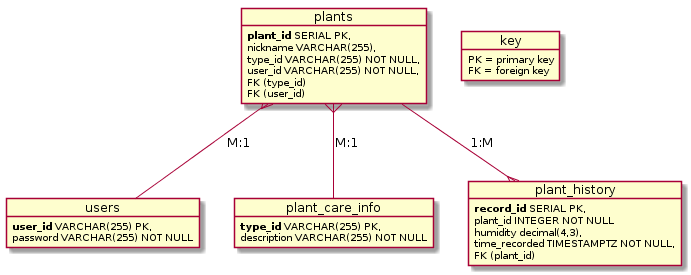

# Design Decisons

## Schema
```
plant_care_info
    type_id VARCHAR(255) PRIMARY KEY,
    description VARCHAR(255) NOT NULL

users
    user_id VARCHAR(255) PRIMARY KEY,
    password VARCHAR(255) NOT NULL

plants
    plant_id SERIAL PRIMARY KEY,
    nickname VARCHAR(255),
    type_id VARCHAR(255) NOT NULL,
    user_id VARCHAR(255) NOT NULL,
    FOREIGN KEY (type_id)
        REFERENCES plant_care_info (type_id),
    FOREIGN KEY (user_id)
        REFERENCES users (user_id)
        ON UPDATE CASCADE ON DELETE CASCADE

plant_history
    record_id SERIAL PRIMARY KEY,
    plant_id INTEGER NOT NULL,
    humidity decimal(4,3),
    time_recorded TIMESTAMPTZ NOT NULL,
    FOREIGN KEY (plant_id)
        REFERENCES plants (plant_id)
        ON UPDATE CASCADE ON DELETE CASCADE
```
## Entity Relationship Diagram


## Table explainations

### users table
_User_id_ is always going to be unique for the user table. If I would have made a serial type, it would have let me enter a non unique _user_id_ and _password_. This way it will reject my insertion of duplicate _user_id_ to maintain integrity. 

### plants table
There really isn't a good way to make sure that your plant is going to be unique. You could have 5 of the same type of plants and not know which one to associate the recorded _humidity_ values with. You could arbitrarily give your plants a _nickname_, but who wants to do that for more than 5 different plants. So, I made the primary key _plant_id_ a serial object to maintain data integrity. I also made it an option for the user to give their plant a _nickname_ so they could keep track of the plant in another way. The _type_ of plant is also important for giving the user the proper care info. And the plant must be associated with a _user_id_ to be in the database. If you delete a user, the plant and its history records are deleted to free up space.

### plant_history table
Again with the data integrity, I decided that a serial object would be the best choice for my primary key of _record_id_. This table also references _plant_id_ as a foreign key to associate readings with the correct plant. The main purpose of this table was to record _humidity_ values and for that I utilized the decimal datatype. This ensured that the readings could be easily converted to percentage later by storing decimal values that range from 0 to 1 inclusive. I also made the data round to the thousandths place for aesthetic purposes. _time_recorded_ was a timestampz object because if this application is used around the world or country, you want to make sure that the time you enter is actually your time, not UTC. Also daylight savings is dumb so lets make sure we account for the weird 25 and 23 hour days.

### plant_care_info table
The _type_ of plant was made the primary key here because the care _description_ info is true for all occurences of those types of plants.

## Python Scripts
All of the scripts in this repository are used to populate the postgres database once you get it running. 

### Create_tables.py Script
This script creates the database tables with the schema I designed. This was crucial during the schema refinement stage when I wanted to drop the tables and start with fresh data.

### Insert_*.py Scripts
I have also made four insert scripts, one for each of the tables. This was useful for testing data as I refined my schema and made restoring tables a breeze. 

### Updating_plants Script
I only had time to create a function that would update a plant's nickname. Names of inanimate objects are just a fun way for the user to keep track of their plants. I wanted the user to be able to change its name without losing history records. Hence, I made the primary key a serial object, which is just an auto incrementing integer.

## Future Improvements

### Adding more fields to the plant_care_info table
The _type_ will not be deleted when all plants of that type are deleted, so eventually I would have liked to have a large dictionary of plants. These plant types would have had information about each type of plant like species, description, preferred temperature and even preferred humidity levels.

### Adding user_id cascade
The database currently does not update the user_id associated with a plant by cascade (plant transfer to another user doesn't work). Honestly, I didn't think about this one when I created the schema. If I wanted to make this app more about the social aspect of plant ownership like buy/sell/trade, I would have made it able to update user_id. I assumed that if you entered in a plant as yours, it was yours until you kill it or something. 

### Improvements to unique humidity reads in plant_history
I would have also wanted to make the history records more unique by giving constraints about no duplications of timestamps but for testing purposes it works.

### GUI
With the amount of time I had, I was unable to create an acceptable gui for viewing the tables and interacting with the database. In the future, this database could probably be connected to an application and hardware like gromet_v1.

## Queries for Information I would have used in Gromet_v1;

### Count how many plants each user has.
```
select user_id, COUNT(plant_id) from plants group by user_id;
```

### Display the timestamp and humidity from a specific plant.
```
select time_recorded, humidity from plant_history where plant_id = 6;
```

### reorder the plant_history table ordered by plant_id
```
select plant_id, time_recorded, humidity from plant_history order by plant_id desc;
```

### Display the user_id associated with each plant in plant_history.
```
select user_id, plant_history.plant_id, time_recorded, humidity from plant_history inner join plants on plants.plant_id = plant_history.plant_id;
```

### Based on a user clicking on one of their plants, we need to know how to care for said plant.
```
select plant_id, nickname, plants.type_id, description from plants inner join plant_care_info on plant_care_info.type_id = plants.type_id where user_id = 'jacob' and nickname = 'Caleb';
```

### For each type of plant a user owns, grab its care info.
```
select plant_id, nickname, plants.type_id, description from plants inner join plant_care_info on plant_care_info.type_id = plants.type_id where user_id = 'jacob';
```